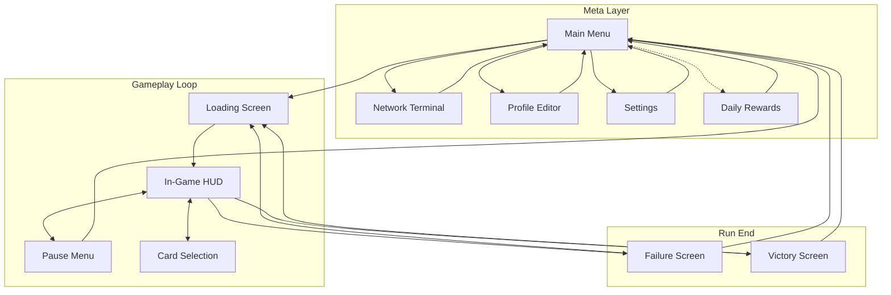

# UI / UX Specification — 0Day Siege

This document defines all **UI screens, HUD elements, overlays, and interaction flows** required for the MVP of *0Day Siege*.  
It focuses on **what exists**, **what it shows**, and **how the player interacts**, not implementation details.

---

## 1. Global UI Principles

### 1.1 Visual Language
- **Theme:** Cybersecurity terminal / military hardware
- **Tone:** Functional, high-contrast, data-forward
- **Perspective:** Slight 3D tilt consistent with game camera
- **Primary Accents:** Cyan (player), Green (positive), Red (threat)

### 1.2 UI Rules
- Gameplay-critical information must be readable at a glance
- No unnecessary animations during combat
- UI should never obscure:
  - Enemies
  - Wall
  - Tower firing lines
- Modal screens (cards, pause, results) **fully pause gameplay**

---

## 2. Screen Flow Overview

### Flow Notes
- Dashed line indicates automatic trigger (Daily Rewards popup)
- Bidirectional arrows indicate modal overlays that return to previous state
- Loading Screen appears before every run start
- Stage/Difficulty/Profile selection integrated into Main Menu

---

## 3. Main Menu

### Purpose
Primary hub for starting runs and accessing meta-progression.

### Elements
- **Game Logo / Title**
- **Run Setup Panel**
  - Stage Selector (dropdown/carousel)
    - Chapter + Stage (e.g. "Chapter 1: Stage 3")
    - Locked stages greyed out with requirement tooltip
  - Difficulty Toggle (Normal / Hard)
    - Hard locked until stage completed on Normal
  - Profile Selector (dropdown)
    - Active profile name
    - "Edit Profile" link
  - **Start Run** button (large, prominent)
- **Secondary Buttons**
  - Network Terminal
  - Profile Editor
  - Settings
  - Quit
- **Persistent Header**
  - Player Level + XP progress bar
  - Data Shards (◈)
  - Decrypt Keys (🔑)
- **Notification Badges**
  - New shop items
  - Unspent mastery points
  - Daily rewards available

### Interaction
- Stage/Difficulty/Profile selections persist between sessions
- Start Run disabled if stage locked or no valid profile
- Start Run leads directly to Loading Screen

---

## 4. In-Game HUD (Core Gameplay)

### Always Visible During Run

#### Top Bar
- **Score**
- **Next Card Threshold**
- **Wave Counter** (e.g. `Wave 7 / 20`)

#### Playfield
- Enemies
- Projectiles
- Effects (non-UI)

#### Wall Area
- **Firewall HP Bar**
  - Numeric current / max
  - Visual damage/glitch effects
  - Critical warning at ≤25%

#### Bottom Area
- **Tower Slots (1–5)**
  - Slot 3 (center) always occupied at start
  - Slot state: empty / occupied
- **Tower Interaction**
  - Tap tower → tooltip + range indicator

#### Corner UI
- **Pause Button**
- **Active Gear Icons**
- **Status Effect Indicators**

---

## 5. Tower Tooltip (Contextual Overlay)

### Trigger
Tap a placed tower.

### Elements
- Tower name
- Detailed stats:
  - Damage
  - Fire rate
  - Range
  - Crit chance & multiplier
  - DPS (base → average)
- Active upgrades
- Mastery level
- Equipped gear effects
- **Range Circle Overlay**

### Behavior
- Tooltip closes on tap outside
- Gameplay continues while tooltip is open

---

## 6. Card Selection Screen (Modal)

### Purpose
Strategic decision point; game is paused.

### Elements
- **Header**
  - Title: "SELECT UPGRADE"
  - Current Decrypt Keys
- **Three Cards**
  - Place Tower
  - Tower Upgrade
  - Wall Repair (conditional)
- **Reroll Button**
  - Cost: 1 Decrypt Key
  - Disabled when player has 0 keys
- **Card Details**
  - Icon
  - Name
  - Target (tower / slot)
  - Effect summary

### Interaction
- Selecting a card immediately applies effect
- Some cards open a secondary selection (slot choice)
- Multiple card triggers can chain sequentially

---

## 7. Pause Menu (Modal)

### Trigger
Pause button during run.

### Elements
- Resume
- Restart Run (confirmation)
- Quit Run (confirmation)
- Settings

### Behavior
- Freezes all gameplay
- Disabled during card selection

---

## 8. Failure Screen

### Trigger
Firewall HP reaches zero.

### Elements
- **Title:** "FIREWALL BREACHED"
- **Stats Summary**
  - Wave reached
  - Enemies defeated
  - Shards earned
- **Buttons**
  - Retry
  - Main Menu

### Notes
- Partial rewards clearly shown
- Encourages retry without friction
- No "Change Stage" (return to Main Menu for that)

---

## 9. Victory Screen

### Trigger
All waves completed and enemies defeated.

### Elements
- **Title:** "SYSTEM SECURED"
- **Performance Summary**
  - Final score
  - Bonuses applied
  - Shards earned
- **Unlock Notifications**
  - New stage
  - Hard mode
  - Gear / chips
- **Buttons**
  - Retry
  - Main Menu

### Notes
- No "Next Stage" button (return to Main Menu to change stage)

---

## 10. Network Terminal (Shop)

### Tabs
- Mastery
- Supply
- Black Market
- Cosmetics

### Shared Header
- Currency display
- Back button

---

### 10.1 Mastery Screen
- Tower list
- Current mastery level
- Progress bar
- Upgrade cost
- Level 5 ability preview

---

### 10.2 Supply Screen
- Chip purchases
- Key purchases
- Consumables
- Prices clearly labeled

---

### 10.3 Black Market
- Daily rotating deals
- Discount indicators
- Timer until refresh
- Limited purchase tags

---

### 10.4 Cosmetics
- Visual-only items
- Preview before purchase
- No gameplay effects

---

## 11. Profile Editor

### Purpose
Configure gear and chips between runs.

### Elements
- Profile name
- Gear slots (5)
- Chip sockets
- Summary stat panel
- Save / Cancel

### Restrictions
- Editing disabled during runs
- Chips freely slotted/unslotted

### Access
- From Main Menu (button or "Edit Profile" link in Run Setup Panel)
- Cannot access during active run

---

## 12. Loading Screen

### Trigger
Displayed during scene transitions:
- After Start Run from Main Menu
- After Retry from Failure/Victory screens

### Elements
- **Stage Info**
  - Chapter name
  - Stage number
  - Difficulty indicator
  - Active profile name
- **Loading Indicator**
  - Progress bar or animated spinner
- **Tip Text** (optional)
  - Rotating gameplay tips

### Behavior
- Minimum display time: 0.5s (prevents flicker)
- Automatically transitions to gameplay when ready

---

## 13. Settings Screen

### Purpose
Configure game options.

### Elements
*TBD — Options to be defined during implementation.*

Potential categories:
- Audio (music, SFX volume)
- Graphics (quality, effects)
- Controls (sensitivity, layout)
- Account (sign in/out)

### Access
- From Main Menu
- From Pause Menu

---

## 14. Daily Rewards Overlay

### Trigger
Automatic popup on Main Menu when unclaimed rewards are available.

### Elements
- **Header:** "DAILY LOGIN REWARD"
- **Reward Display**
  - Day number in streak
  - Today's reward (Shards, Keys, Chips, etc.)
  - Preview of upcoming rewards (next 2–3 days)
- **Streak Counter**
  - Current streak length
  - Streak reset warning if applicable
- **Claim Button**
- **Close Button** (if already claimed)

### Behavior
- Appears once per day on first Main Menu visit
- Cannot be dismissed without claiming (first appearance)
- After claiming, can be accessed via notification badge

---

## 15. Onboarding Flow

### Purpose
Introduce new players to core mechanics.

### Elements
*TBD — To be defined based on tutorial scope.*

### Notes
- First-run experience only
- Should not block returning players
- Minimal popups per UX Non-Goals

---

## 16. Notifications & Feedback

### In-Run Notifications
- Gear triggers
- Wall repair activated
- Low wall HP warning

### Visual Feedback
- Damage numbers
- Crit indicators
- Status effect icons
- Subtle screen shake for major events

---

## 17. UX Non-Goals (MVP)

- No tutorial popups beyond first run basics
- No minimap
- No per-tower targeting modes UI
- No real-time economy management UI

---

## 18. Accessibility & Readability

- High-contrast text
- Numeric values always visible
- Color + icon redundancy for critical info
- Scales correctly across aspect ratios using background extension

---

## 19. Summary

The UI of *0Day Siege* is:
- **Information-dense**
- **Combat-first**
- **Strategic, not micro-heavy**
- **Thematically cohesive**

Every UI element exists to answer one of three questions:
1. *Am I winning or losing right now?*
2. *What decision do I need to make next?*
3. *Why did this outcome happen?*

If a UI element does not serve one of these, it should not exist.